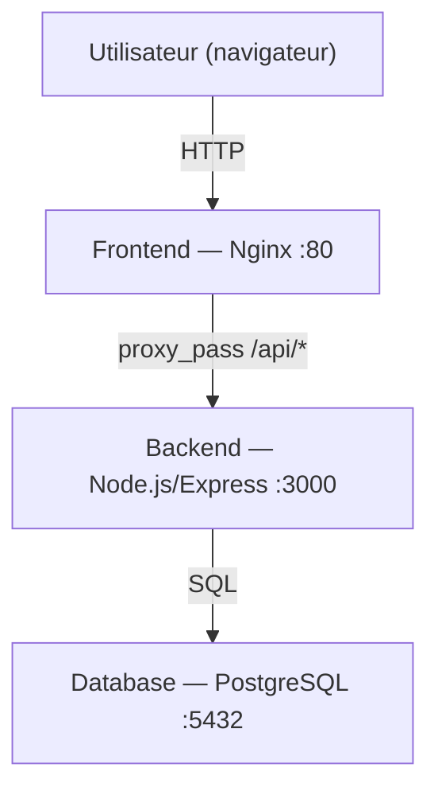

# VitalSync

Application de suivi médical et sportif — projet DevOps EFREI E6 2026.

---

## Architecture



- **Frontend** : Nginx sert `index.html` et proxifie les requêtes `/api/*` vers le backend.
- **Backend** : API REST Node.js/Express exposant `/api/health` et `/api/activities`.
- **Database** : PostgreSQL avec volume persistant pour conserver les données entre redémarrages.

---

## Prérequis

| Outil | Version minimale |
|-------|-----------------|
| Docker | 24.x |
| Docker Compose | v2.x (`docker compose`) |
| Git | 2.x |
| Node.js (dev local) | 20.x |

---

## Lancer l'application en local

### 1. Cloner le dépôt

```bash
git clone https://github.com/Lajous-Harold/VitalSync.git
cd VitalSync
```

### 2. Configurer les variables d'environnement

```bash
cp .env.example .env
# Editer .env avec vos valeurs
```

### 3. Démarrer les services

```bash
docker compose up --build
```

Les 3 services démarrent :
- Frontend accessible sur `http://localhost`
- Backend accessible via le proxy sur `http://localhost/api/health`
- PostgreSQL interne au réseau Docker (non exposé)

### 4. Arrêter

```bash
docker compose down
```

Pour supprimer aussi le volume PostgreSQL :

```bash
docker compose down -v
```

---

## Pipeline CI/CD (GitHub Actions)

Fichier : `.github/workflows/ci.yml`

Déclencheurs :
- `push` sur la branche `develop`
- `pull_request` vers `main`

### Étapes

```
lint-test → build-push → deploy-staging
```

| Job | Ce qu'il fait |
|-----|---------------|
| **Lint & Tests** | `npm install`, ESLint, Jest |
| **Build & Push** | Construit les images Docker et les pousse sur GHCR avec le SHA du commit comme tag |
| **Deploy Staging** | `docker compose up`, health check sur `/api/health`, échec si pas de réponse |

### Pourquoi le tag par SHA ?

Un tag `latest` est écrasé à chaque build — impossible de savoir quelle version tourne en production. Le SHA du commit est immuable et traçable : on peut retrouver exactement quel code correspond à quelle image.

---

## Choix techniques

| Choix | Justification |
|-------|---------------|
| **Node.js 20-alpine** | Image légère (~50 MB), LTS, compatible avec les dépendances Express et Jest |
| **Multi-stage build** | Le stage `builder` exécute les tests ; le stage `production` n'embarque pas les devDependencies ni les outils de test, réduisant la surface d'attaque |
| **Nginx comme reverse proxy** | Centralise le trafic entrant, gère le proxy `/api/*` vers le backend sans exposer ce dernier directement |
| **Réseau bridge dédié** | Isole les conteneurs VitalSync des autres réseaux Docker sur la machine ; les services communiquent par nom (`backend`, `database`) sans exposer les ports en dehors du réseau |
| **Volume PostgreSQL** | Sans volume, `docker compose down` supprime les données. Le volume `postgres-data` persiste entre les redémarrages |
| **GHCR (GitHub Container Registry)** | Intégré nativement à GitHub Actions via `GITHUB_TOKEN`, sans secret supplémentaire à configurer |
| **GitHub Actions** | Intégré au dépôt GitHub, syntaxe YAML simple, runners Ubuntu gratuits pour les projets publics |
| **ESLint** | Détecte les erreurs statiques avant l'exécution ; configuré avec `eslint:recommended` pour Node.js |

---

## Structure du dépôt

```
VitalSync/
├── backend/
│   ├── server.js          # API Express
│   ├── package.json
│   ├── dockerfile         # Multi-stage build
│   ├── .dockerignore
│   ├── .eslintrc.json
│   └── test/
│       └── health.test.js
├── frontend/
│   ├── index.html
│   ├── dockerfile
│   └── nginx.conf         # Reverse proxy vers backend
├── k8s/
│   ├── backend-deployment.yml
│   ├── backend-service.yml
│   ├── frontend-ingress.yml
│   └── db-secret.yml
├── .github/
│   └── workflows/
│       └── ci.yml
├── docker-compose.yml
├── .env.example
└── README.md
```

---

## Branches

| Branche | Rôle |
|---------|------|
| `main` | Production — push direct interdit, PR obligatoire |
| `develop` | Intégration — pipeline CI/CD déclenchée à chaque push |
| `feature/*` | Développement de fonctionnalités isolées |
